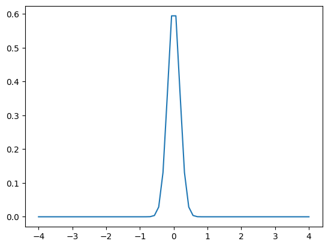
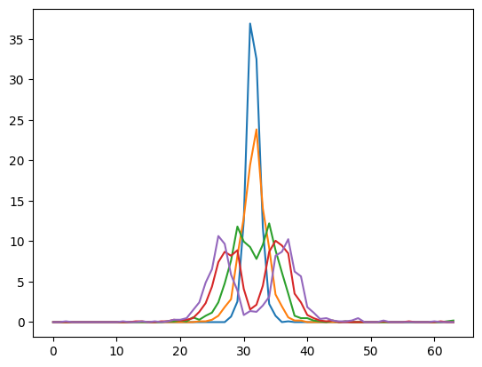
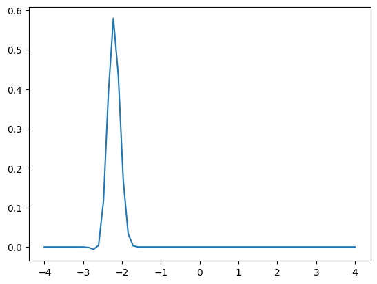
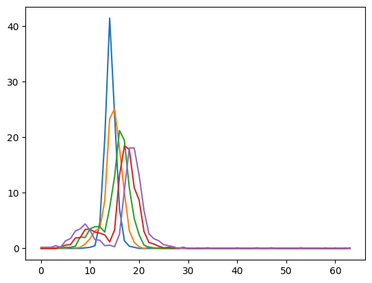

# 1D_Quantum_Mechanics_Simulation
## Time Evolution of Gaussian Wavepacket 

| KE            |  Initial State |  Nth iteration |
:-------------------------:|:-------------------------:|:-------------------------:
KE=0 |   | 
KE=K_0  |   | 
